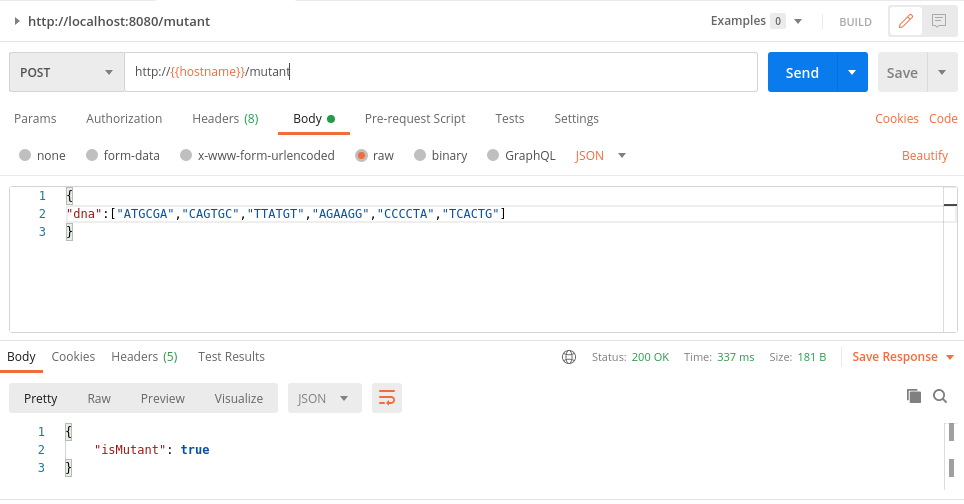
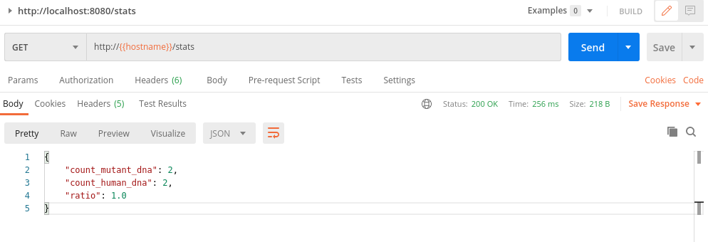

# Mutant REST API

Esta rest api fue desarrollada en Spring Boot. El objetivo es poder determinar si una secuencia de ADN corresponde a un mutante o a un humano.
También se puede usar para conocer datos estadísticos de mutantes y humanos.

## API endpoints

### /mutant/

Este endpoint se consume mediante método POST y recibe como argumento un JSON con la información de la secuencia de ADN.
Todas la secuencias de ADN son matrices de caracteres N x N (cuadradas).

    POST → /mutant/
    {
        “dna”:["ATGCGA","CAGTGC","TTATGT","AGAAGG","CCCCTA","TCACTG"]
    }

En caso de que sea un mutante devuelve status 200 OK acompañado del mensaje JSON:

    {
        "isMutant": true
    }

En caso contrario o en caso de que se detecte un error (por ejemplo que la matrix no sea N x N) devuelve 403 Forbidden

    {
        "timestamp": "2021-04-03T20:47:00.160+00:00",
        "status": 403,
        "error": "Forbidden",
        "message": "",
        "path": "/mutant"
    }

### /stats/

Este endpoint se consume mediante método GET y no recibe parámetros. Devuelve un contador que representa la cantidad de ADN mutante , otro que es la cantidad de ADN humano y un ratio (ratio = cantidad_adn_mutante / cantidad_adn_humano).

    {
        "count_mutant_dna": 2,
        "count_human_dna": 2,
        "ratio": 1.0
    }

## Detalles de implementación

### Framework y configuración de proyecto

El proyecto spring boot se generó usando: https://start.spring.io/. Como base de datos se usa Amazon DynamoDB que es una base de datos NoSQL.

### DNAHelper - Método isMutant(...);

Es el método núcleo que se encarga de decidir si una matriz de ADN es humana o mutante.

Firma del método:
    boolean isMutant(String[] dna); // Ejemplo Java

Internamente isMutant utiliza el método countSequences(...) para contar secuencias de letras repetidas. Este método usa vectores Z^2 (vectores de dos componentes enteros) que recorren la matriz como si fuera un plano bidimensional.

    private int countSequences(String[] dna, Vec2d iniPos, Vec2d dir, int sequenceLength);

**countSequences** recibe como argumentos:

* *dna*: matriz de código adn.
* *iniPos*: vector posición inicial desde la que espera encontrar una secuencia repetida.
* *dir*: vector dirección hacia donde se irá desplazando para encontrar sucesivos códigos repetidos.
* *sequenceLength*: la cantidad de elementos que deben repetirse para considerarse 1 ocurrencia de código ADN mutante (en este caso siempre es 4).

De forma muy general se puede decir que este método recorre la matriz en el siguiente orden:

1. Lineas **verticales y horizontales**.

    *fig 1*
    | ↓→ | → | → |
    |:--:|:-:|:-:|
    |  ↓ | A | A |
    |  ↓ | A | A |

    *fig 2*
    | A |  ↓ | A |
    |:-:|:--:|:-:|
    | → | ↓→ | → |
    | A |  ↓ | A |

    *fig 3*
    | A | A |  ↓ |
    |:-:|:-:|:--:|
    | A | A |  ↓ |
    | → | → | ↓→ |

2. **Lineas oblicuas**
    * **Diagonales principales**

        *fig 1*
        | ⬊ | A | A |
        |:--:|:-:|:-:|
        |  A | ⬊ | A |
        |  A | A | ⬊ |

        *fig 2*
        | A | A | ⬋ |
        |:-:|:-:|:-:|
        | A | ⬋ | A |
        | ⬋ | A | A |

    * **Diagonales secundarias** simétricas respecto de las diagonales principales

        *fig 1*
        | A | ⬊ | A |
        |:-:|:-:|:-:|
        | ⬊ | A | ⬊ |
        | A | ⬊ | A |

        *fig 2*
        | A | ⬋ | A |
        |:-:|:-:|:-:|
        | ⬋ | A | ⬋ |
        | A | ⬋ | A |

*Observaciones*:

* El caso de ejecución más óptimo se da cuando se alcanzan a contar 2 secuencias de letras repetidas en los primeros ciclos (líneas verticales u horizontales), seguido de diagonales principales, seguido de diagonales secundarias simetricas de la diagonal principal.
* El caso de ejecución más lento es cuando no existen secuencias repetidas y la matriz debe ser recorrida en su totalidad en todos los sentidos para llegar a esta conclusión.
* El código está hecho de forma tal que se pueda terminar antes el ciclo en caso de encontrar la cantidad suficiente de secuencias, impidiendo el recorrido completo de la matriz.

Ejemplo de código **isMutant**:

    public boolean isMutant(String[] dna)
    {
        //Check if there are repeated letters
        int sequencesCounter = 0;

        for(int ind = 0; ind < dna.length; ind++)
        {
            sequencesCounter += countSequences(dna, new Vec2d(0, ind), new Vec2d(1, 0), mutantSeqLength); // horizontal sequences
            if(sequencesCounter > 1) return true;
            
            sequencesCounter += countSequences(dna, new Vec2d(ind, 0), new Vec2d(0, 1), mutantSeqLength); // vertical sequences
            if(sequencesCounter > 1) return true;
        }
        
        sequencesCounter += countSequences(dna, new Vec2d(0, 0), new Vec2d(1,1), mutantSeqLength); //main diagonal (top, left) -> (bottom, right)
        if(sequencesCounter > 1) return true;
        
        sequencesCounter += countSequences(dna, new Vec2d(dna.length - 1, 0), new Vec2d(-1,1), mutantSeqLength); //secondary diagonal (top, right) -> (bottom, left)
        if(sequencesCounter > 1) return true;

        //the other diagonals that could contain mutant sequences
        for(int ind = 1; ind <= dna.length - mutantSeqLength; ind++)
        {
            sequencesCounter += countSequences(dna, new Vec2d(0, ind), new Vec2d(1,1), mutantSeqLength); // "\"
            if(sequencesCounter > 1) return true;

            sequencesCounter += countSequences(dna, new Vec2d(ind, 0), new Vec2d(1,1), mutantSeqLength); // "\"
            if(sequencesCounter > 1) return true;

            sequencesCounter += countSequences(dna, new Vec2d(dna.length - 1 - ind, 0), new Vec2d(-1,1), mutantSeqLength); // "/"
            if(sequencesCounter > 1) return true;

            sequencesCounter += countSequences(dna, new Vec2d(dna.length - 1, ind), new Vec2d(-1,1), mutantSeqLength); // "/"
            if(sequencesCounter > 1) return true;
        }

        return sequencesCounter > 1;
    }

### DNAHasher - Persistencia de ADN en base de datos.

Con el fin de evitar la comparación de arreglos de cadenas en la base de datos se está utilizando un método para crear un escalar entero en base a la matriz de código ADN. Este escalar entero es utilizado como identificador en la tabla de la base de datos.

Este identificador entero ayuda a determinar si una secuencia de ADN ya fue insertada con anterioridad en la base de datos.

Esta función está contenida dentro de la clase DNAHasher y recorre los caracteres que forman parte de la secuancia transformandolos en valores enteros.

Este algoritmo considera que el **alfabeto de la matriz de ADN: {A, C, G, T}** puede ser interpretado como un subconjunto de dígitos Base 5.

Siendo: **{X, A, C, G, T}, los símbolos de un sistema de numeración Base 5**.

* X -> 0
* A -> 1
* C -> 2
* G -> 3
* T -> 4

*Observaciones*:
* X es cualquier símbolo que no sea ACGT.
* X se introduce como 0 para brindar caracter significativo a los números A que estén por delante en una secuencia por ejemplo: AACGT != 00CGT

De esta forma el hasher transforma cada línea horizontal de la matriz de la siguiente forma:

    escalar_horizontal = V(n) * 5^(n) + V(n-1) * 5^(n-1) + ... + V(0) * 5^(0)

Siendo V(n) el valor correspondiente al dígito en la posición n.

Luego como cada matriz debe ser diferente el escalar_horizontal se multiplica por su posición (base 1 de la matriz):

    escalar_matriz = n * escalar_horizontal(n) + (n-1) * escalar_horizontal(n-1) + ... + 1 * escalar_horizontal(1)

Con el fin de no exceder el tamaño de las variables enteras se utiliza mod (%) para quedarnos con el equivalente modular de un entero en caso de que exceda el tamaño máximo de un entero de Java (Integer.MAX_VALUE): 

    private int getScalarFromDNAString(String dna)
    {
        int scalar = 0;
        for(int ind = 0; ind < dna.length(); ind++)
            scalar += (getScalarFromChar(dna.charAt(ind)) * Math.pow(5, ind)) % Integer.MAX_VALUE;
        return scalar;
    }

Observaciones:
* La introducción de este mod(%) y la posibilidad de procesar matrices N x N de muchas más dimensiones crea la posibilidad de una colisión para este hasher.
* *La resolución de dichas colisiones no forman parte de este proyecto*.

## Cómo ejecutar API

La api está alojada en Amazon Web Services (AWS):

1. http://ec2-18-188-38-174.us-east-2.compute.amazonaws.com:8080/mutant/
2. http://ec2-18-188-38-174.us-east-2.compute.amazonaws.com:8080/stats/

Para consumirlos podemos usar Postman (https://www.postman.com/).

**Ejemplo de consumo de /mutant/**

*Observaciones*
* Usar POST para invocar /mutant/
* Para enviar el JSON como argumento usar BODY > RAW > Seleccionar JSON (para que la rest api entienda el encabezado del request).
* Reemplazar {{hostname}} por el DNS apropiado: http://ec2-18-188-38-174.us-east-2.compute.amazonaws.com:8080
* También se pueden crear variables de entorno tipo {{hostname}} = http://localhost:8080

**Ejemplo de consumo de /stats/**

*Observaciones*
* Usar GET para invocar /stats/
* No hace falta enviar ningun parámetro en el cuerpo del REQUEST.

## Cómo ejecutar de forma local

### Configurar conexión a base local (opcional)

Para ejecutar de forma local tenemos dos opciones. Usamos una instancia de la base DynamoDB local o apuntamos directamente contra la instancia viva en AWS.Para controlar esto podemos editar el archivo application.properties:

    server.port=8080

    #DEVELOPMENT
    #amazon.dynamodb.endpoint=http://localhost:8000/

    #PRODUCTION
    amazon.dynamodb.endpoint=https://dynamodb.us-east-2.amazonaws.com

    amazon.aws.accesskey=**SECRET**
    amazon.aws.secretkey=**SECRET**

* Si queremos apuntar a la instancia local comentamos la línea que apunta al DNS name de DynamoDB y dejamos descomentado el que apunta a http://localhost:8000.

* Tener en cuenta que si decidimos conectarnos a una instancia local de DynamoDB vamos a tener que bajarnos el paquete que nos permite correr la instancia de forma local y dejarlo en ejecución. Además tendremos que crear la estructura de la base de datos para poder consultar o insertar información.

### DynamoDB Local vs DynamoDB Live

Por defecto la aplicación está configurada para acceder a la base de datos DynamoDB instanciada en AWS.

Pero en caso de necesitar un entorno de desarrollo que no modifique la base de datos productiva se puede utilizar una instancia local.

Para dejar instalada una instancia local de DynamoDB en nuestra máquina tendremos que bajar un jar del siguiente link: https://docs.aws.amazon.com/amazondynamodb/latest/developerguide/DynamoDBLocal.DownloadingAndRunning.html

Una vez que lo descomprimimos en una ubicación, abrimos una terminal en esa carpeta y ejecutamos:

    java -Djava.library.path=./DynamoDBLocal_lib -jar DynamoDBLocal.jar -sharedDb

### Comandos útiles para DynamoDB

1. Listar tablas

        aws dynamodb list-tables --endpoint-url http://localhost:8000 

2. Listar contenido de tablas

        aws dynamodb scan --table-name dna_t1 --endpoint-url http://localhost:8000

3. Crear una tabla usando la shell de Javascript (http://localhost:8000/shell/).

        var params = {
        TableName: 'dna_t1',
            KeySchema: [ 
                {
                    AttributeName: 'id',
                    KeyType: 'HASH',
                },
            ],
            AttributeDefinitions: [ 
                {
                    AttributeName: 'id',
                    AttributeType: 'N', 
                },
            ],
            ProvisionedThroughput: { 
                ReadCapacityUnits: 10, 
                WriteCapacityUnits: 10, 
            },
        };

        dynamodb.createTable(params, function(err, data) {
            if (err) ppJson(err); // an error occurred
            else ppJson(data); // successful response
        });
    
    * En particular este script nos sirve para crear una tabla *dna_t1* que es la estructura de datos que utiliza esta implementación.

### Crear build del proyecto.

Abrimos la carpeta donde esté clonado el repositorio y abrimos una terminal donde ejecutamos:

    $ mvn clean package

Al terminar deberíamos ver algo así en la consola

    [INFO] 
    [INFO] Results:
    [INFO] 
    [INFO] Tests run: 4, Failures: 0, Errors: 0, Skipped: 0
    [INFO] 
    [INFO] 
    [INFO] --- maven-jar-plugin:3.2.0:jar (default-jar) @ restapi ---
    [INFO] Building jar: /home/marcos/Documents/java_projects/restapi/target/restapi-0.0.1-SNAPSHOT.jar
    [INFO] 
    [INFO] --- spring-boot-maven-plugin:2.4.4:repackage (repackage) @ restapi ---
    [INFO] Replacing main artifact with repackaged archive
    [INFO] ------------------------------------------------------------------------
    [INFO] BUILD SUCCESS
    [INFO] ------------------------------------------------------------------------
    [INFO] Total time:  15.348 s
    [INFO] Finished at: 2021-04-04T17:32:09-03:00
    [INFO] ------------------------------------------------------------------------

Nuestro archivo a ejecutar es : **restapi-0.0.1-SNAPSHOT.jar**

Antes de poner a correr el jar debemos liberarnos de cualquier proceso que esté escuchando el puerto 8080 que vamos a usar, para ello usamos el siguiente comando:
    
    $ fuser -k 8080/tcp

Luego ejecutamos el jar dentro de la ubicación /restapi/target/restapi-0.0.1-SNAPSHOT.jar

    $ java -jar restapi-0.0.1-SNAPSHOT.jar
    
**Observaciones**
* También podemos abrir la carpeta con un editor de código como el VSCode y si tenemos correctamente configurados los paths a la SDK de Java podemos compilar directamente desde VSCode con F5.